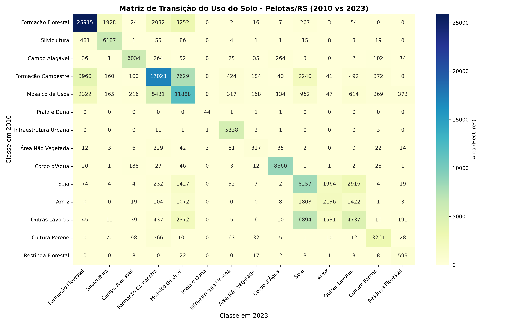

# 🌍 Análise da Dinâmica do Uso e Cobertura do Solo em Pelotas/RS (2010 vs 2023)


## 📌 Visão Geral
Este projeto analisa as transformações no uso e cobertura do solo no município de **Pelotas/RS** entre os anos de **2010 e 2023**. A metodologia integra geoprocessamento automatizado em **Python** (para manipulação de matrizes raster e análise estatística) e cartografia temática no **QGIS** (para elaboração da prancha de apresentação final).

---

## 📊 Principais Resultados

### 1. Matriz de Transição de Uso do Solo (Python / Seaborn)
Através do processamento dos dados raster com `rasterio` e `pandas`, foi gerada a matriz de transição quantitativa (em hectares) para identificar padrões de mudança agrícola e expansão urbana.



* **Destaques da Análise:**
  * **Estabilidade:** Manutenção expressiva das áreas de Formação Florestal e Formação Campestre.
  * **Dinâmica Agrícola:** Expansão e alternância em culturas temporárias como Arroz e Soja.
  * **Crescimento Urbano:** Consolidação e expansão da mancha urbana no setor sul do município.

---

## 🗺️ Cartografia Temática Comparativa (QGIS)

Elaboração de mapa temático comparativo utilizando o Layout de Impressão do QGIS, com padronização da legenda oficial MapBiomas e enquadramento em **SIRGAS 2000 / UTM zone 22S (EPSG:31982)**.


---

## 🛠️ Tecnologias e Ferramentas

- **Linguagem / Bibliotecas:** Python (`rasterio`, `geopandas`, `pandas`, `seaborn`, `matplotlib`)
- **SIG / Cartografia:** QGIS 3.x
- **Ambiente:** Ubuntu / WSL2
- **Fonte de Dados:** MapBiomas Brasil (Coleção 11 - Resolução 30m) & Limites Municipais IBGE (2025)

---

## 📁 Estrutura do Repositório

```text
├── dados_brutos/          # Contém os rasters originais e vetor de limites
├── dados_processados/     # Matriz CSV, Heatmap PNG e Mapa Final PDF/PNG
├── 01_corta_raster.py     # Script de recorte da AOI
├── 02_calcula_transicao.py # Script para geração da matriz em hectares e heatmap
└── README.md              # Documentação do projeto
